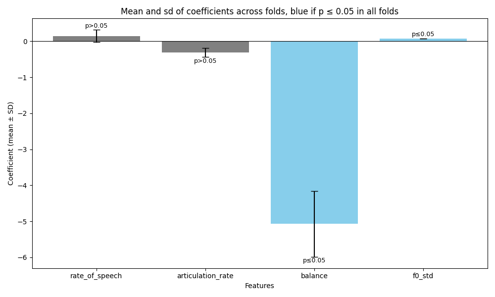
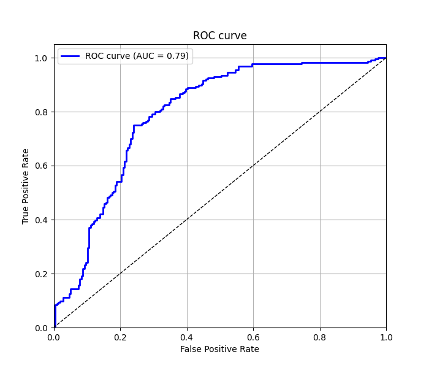
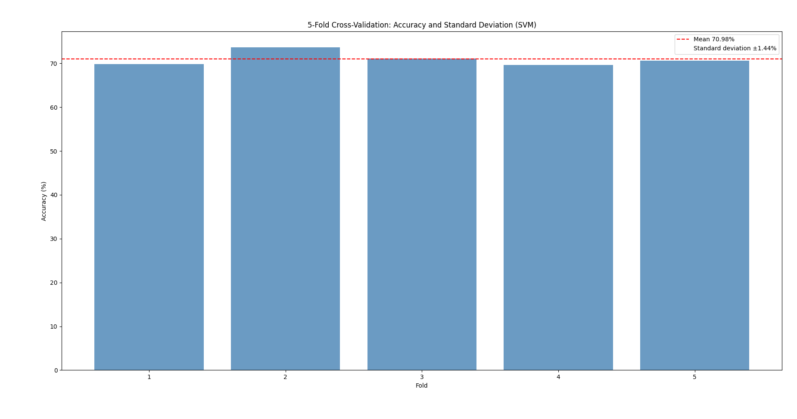
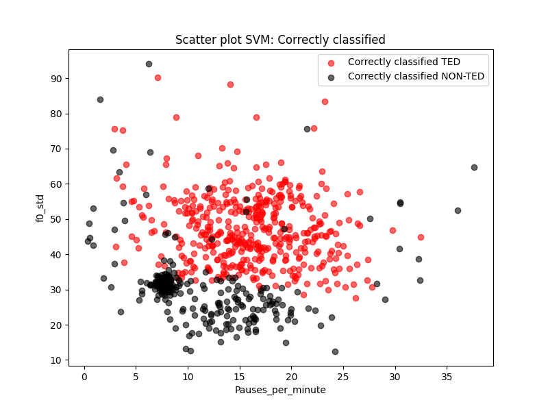
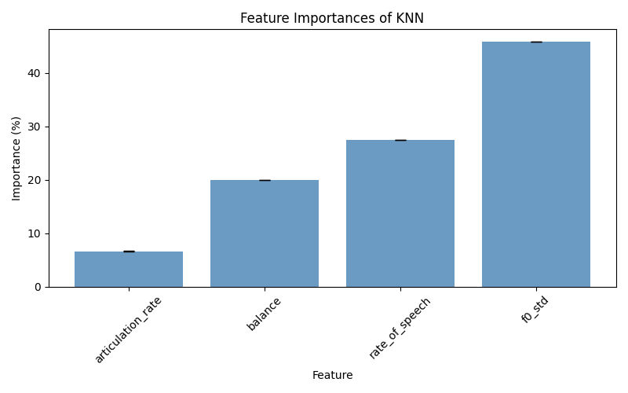
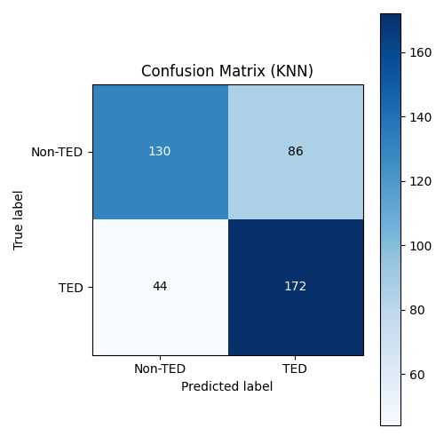
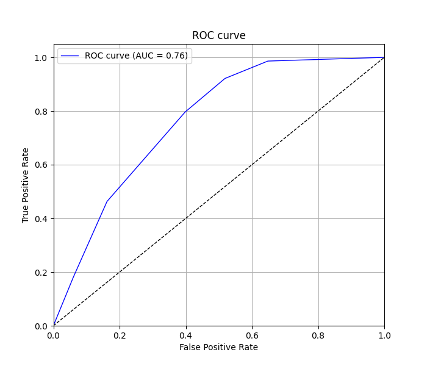
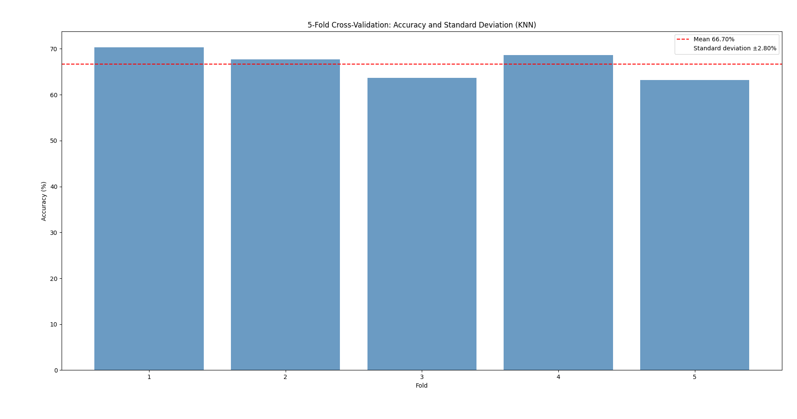
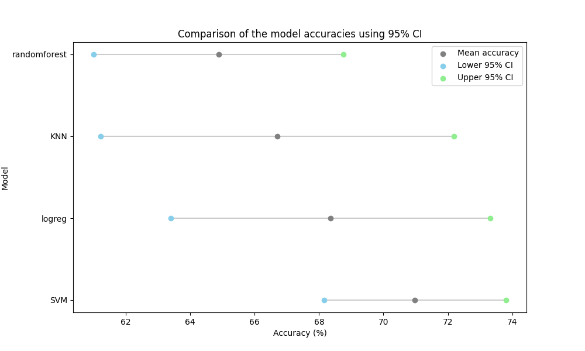

# Results

## Logistic Regression

As the logistic regression model is implemented using statsmodels, it allows us to gather more detailed metrics about the model.
For example, using p-values with the significance level of 0.05 we can see that out of the features, **"balance"** and **"f0_std"** are statistically significant, with a p-value of less than or equal to 0.05. The coefficient of "balance" is also the most significant at almost -5. This implies that TED-speakers have lower balance-values, meaning that their speeches contain more pauses. The coefficient of "f0_std" is not as significant, but it does imply that TED-speakers tend to have more pitch variability.

The confusion matrix of the model show that the model does make a significant amount of wrong classifications, which tend to be equally distributed between the classes. The overall accuracy **0.6884 ± 0.0209** of the model is decent.

The ROC curve gives a slightly better perspective, with an AUC of **0.75 ± 0.02**, suggesting a good ability to distinguish between TED and non-TED talks.

Lastly, the Pseudo R-squared value of **0.1360 ± 0.0080** indicates a moderate explanatory power.

## Random Forest

Interestingly, the feature importance values of the random forest model are noticeably different to the logreg model's coefficients. Mainly, the importance of **"f0_std"** is clearly the highest at around 0.8, with **"balance"** coming second at only around 0.15. The other two remain relatively insignificant. This indicates that, according to the random forest, pitch variability plays a dominant role in partitioning the data across the trees.

The confusion matrix is quite similar to the logreg model, but there is a noticeable drop in overall accuracy, down to around **0.6293 ± 0.0244**.

As with the logistic regression model, the ROC curve gives a slightly better rating, with an AUC of **0.71 ± 0.01**, suggesting a reasonable ability to distinguish between TED and non-TED talks.

## Support Vector Machine (SVM)

Again the feature importance stays the same as in previous models. **"f0_std"** is again the highest at 0.66 and **"balance"** at the second place at 0.22. The two other features are staying at around 0.05.

The overall accuracy is around **74%**. The confusion matrix has some differences because it is predicting more TED:s vs NON-TED:s than the previous models. Also the is differences in precision, recall and f1-score between 0 and 1 classifications but is still they are looking alright.

|              |   precision |   recall |   f1-score |    support |
|:-------------|------------:|---------:|-----------:|-----------:|
| 0            |    0.82     | 0.61     |   0.70     | 216        |
| 1            |    0.69     | 0.87     |   0.77     | 216        |
| accuracy     |             |          |   0.74     | 432        |
| macro avg    |    0.76     | 0.74     |   0.74     | 432        |
| weighted avg |    0.76     | 0.74     |   0.74     | 432        |

The ROC curve gives a slightly better perspective, with an AUC of **0.79**, suggesting a good ability to distinguish between TED and non-TED talks. Almost over 0.8 which would have been generally considered a good model.

Using K-Fold, with five folds the SVM model achieved a mean accuracy of **71%** with a low standard deviation of **1.44%**. This indicates that the model's performance is stable and consistent with different data splits.

Below we can see how the **"f0_std"** really affects in the classification with SVM.

## K-nearest neighbors (KNN)

Again **"f0_std"** is the most important feature at 0.46 but now **"rate_of_speech"** is at second place at 0.27. **"balance"** is also up there at 0.2 and lastly **"articulation_rate"** at 0.065.

The overall accuracy is around **70%**. Again the confusion matrix has some differences because it is predicting more TED:s vs NON-TED:s than the first 2 models, but is similar to SVM. Also the is differences in precision, recall and f1-score between 0 and 1 classifications but is still they are looking alright.

|              |   precision |   recall |   f1-score |    support |
|:-------------|------------:|---------:|-----------:|-----------:|
| 0            |    0.75     | 0.60     |   0.67     | 216        |
| 1            |    0.67     | 0.80     |   0.73     | 216        |
| accuracy     |             |          |   0.70     | 432        |
| macro avg    |    0.71     | 0.70     |   0.70     | 432        |
| weighted avg |    0.71     | 0.70     |   0.70     | 432        |

The ROC curve is quite similar with the SVM, with an AUC of **0.76**, suggesting a good ability to distinguish between TED and non-TED talks.

Using K-Fold, with five folds the KNN model achieved a mean accuracy of **66.7%** with a standard deviation of **2.8%**. This indicates that the model's performance is not as good as in SVM for example, but can still make quite good predictions with different data splits.

## Comparison between model accuracies

In a graph showing a 95% confidence interval for the accuracies, the models are in a distinct order and can thus be ranked easily. **SVM is clearly the most accurate**, being the only model to achieve a mean accuracy of over 70%. It also has the lowest spread of the models. Second most accurate is logistic regression, which falls under 70% in mean accuracy and has a slightly bigger spread. Third is KNN. However it has the largest spread, and at its best it's close to the best results of the previous two. The random forest model comes in last. It only has a bit less spread than KNN, but the entire interval is noticeably worse than the rest.

