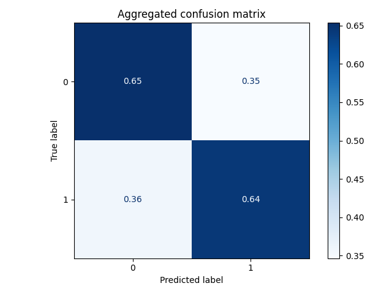

# Results

## Logistic Regression

As the logistic regression model is implemented using statsmodels, it allows us to gather more detailed metrics about the model.
For example, using p-values with the significance level of 0.05 we can see that out of the features, **"balance"** and **"f0_std"** are statistically significant, with a p-value of less than or equal to 0.05. The coefficient of "balance" is also the most significant at less than -5. This implies that TED-speakers have lower balance-values, meaning that their speeches contain more pauses. The coefficient of "f0_std" is not as significant, but it does imply that TED-speakers tend to thave more pitch variability. Furthermore the p-value of "articulation_rate" is just slightly over the significance level, but its coefficient is also not nearly as significant as "balance"s. The negative value of it does imply that TED-speakers talk at a slightly slower rate (when using the speaking duration, which has removed pauses).

The confusion matrix, and the precision, recall and f1-score metrics of the model show that the model does make a significant amount of wrong classifications, with the overall accuracy being around **69.4%**

|              |   precision |   recall |   f1-score |    support |
|:-------------|------------:|---------:|-----------:|-----------:|
| 0            |    0.702899 | 0.673611 |   0.687943 | 144        |
| 1            |    0.686667 | 0.715278 |   0.70068  | 144        |
| accuracy     |    0.694444 | 0.694444 |   0.694444 |   0.694444 |
| macro avg    |    0.694783 | 0.694444 |   0.694312 | 288        |
| weighted avg |    0.694783 | 0.694444 |   0.694312 | 288        |

The ROC curve gives a slightly better perspective, with an AUC of **0.75**, suggesting a good ability to distinguish between TED and non-TED talks.

Lastly, the Pseudo R-squared value of **0.1355** indicates a moderate explanatory power.

## Random Forest

Interestingly, the feature importance values of the random forest model are noticeably different to the logreg model's coefficients. Mainly, the importance of **"f0_std"** is clearly the highest at around 0.8, with **"balance"** coming second at only around 0.15. The other two remain relatively insignificant. This indicates that, according to the random forest, pitch variability plays a dominant role in partitioning the data across the trees.

The confusion matrix, and the precision, recall and f1-score metrics are quite similar to the logreg model, although there is a noticeable dip in overall accuracy, down to around **63.5%**

|              |   precision |   recall |   f1-score |    support |
|:-------------|------------:|---------:|-----------:|-----------:|
| 0            |    0.638298 | 0.625    |   0.631579 | 144        |
| 1            |    0.632653 | 0.645833 |   0.639175 | 144        |
| accuracy     |    0.635417 | 0.635417 |   0.635417 |   0.635417 |
| macro avg    |    0.635475 | 0.635417 |   0.635377 | 288        |
| weighted avg |    0.635475 | 0.635417 |   0.635377 | 288        |

As with the logistic regression model, the ROC curve gives a slightly better rating, with an AUC of **0.68**, suggesting a reasonable ability to distinguish between TED and non-TED talks.

