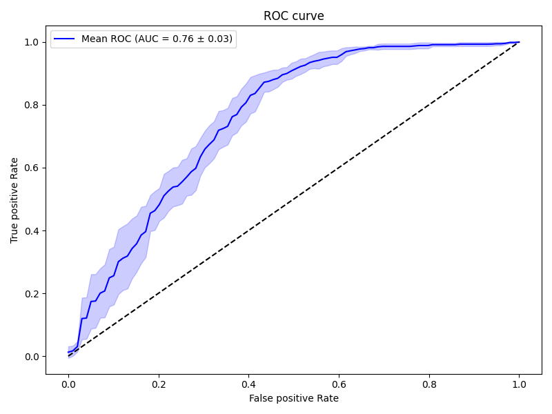
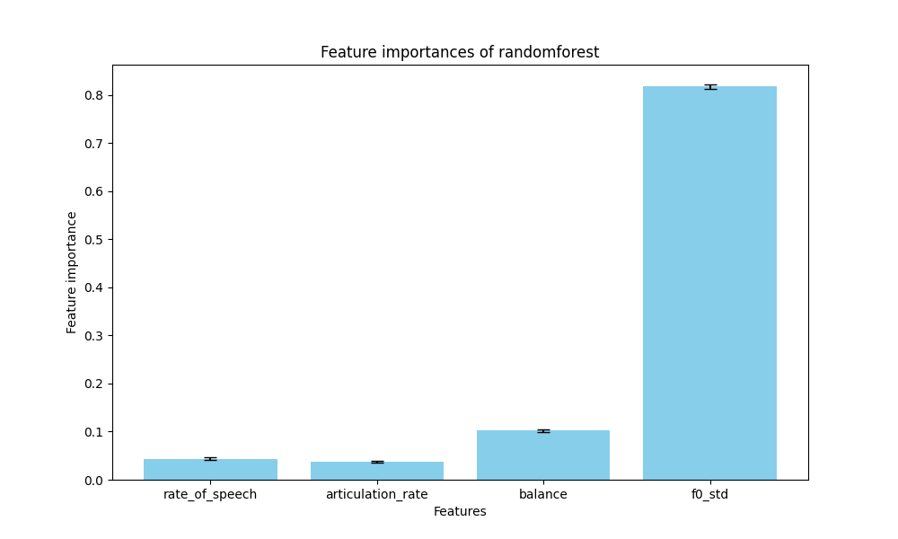
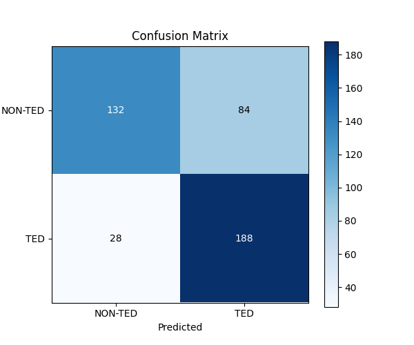

# Results

## Logistic Regression

As the logistic regression model is implemented using statsmodels, it allows us to gather more detailed metrics about the model.
For example, using p-values with the significance level of 0.05 we can see that out of the features, **"balance"** and **"f0_std"** are statistically significant, with a p-value of less than or equal to 0.05. The coefficient of "balance" is also the most significant at less than -5. This implies that TED-speakers have lower balance-values, meaning that their speeches contain more pauses. The coefficient of "f0_std" is not as significant, but it does imply that TED-speakers tend to thave more pitch variability. Furthermore the p-value of "articulation_rate" is just slightly over the significance level, but its coefficient is also not nearly as significant as "balance"s. The negative value of it does imply that TED-speakers talk at a slightly slower rate (when using the speaking duration, which has removed pauses).

The confusion matrix, and the precision, recall and f1-score metrics of the model show that the model does make a significant amount of wrong classifications, with the overall accuracy being around **69.4%**

|              |   precision |   recall |   f1-score |    support |
|:-------------|------------:|---------:|-----------:|-----------:|
| 0            |    0.702899 | 0.673611 |   0.687943 | 144        |
| 1            |    0.686667 | 0.715278 |   0.70068  | 144        |
| accuracy     |    0.694444 | 0.694444 |   0.694444 |   0.694444 |
| macro avg    |    0.694783 | 0.694444 |   0.694312 | 288        |
| weighted avg |    0.694783 | 0.694444 |   0.694312 | 288        |

The ROC curve gives a slightly better perspective, with an AUC of **0.75**, suggesting a good ability to distinguish between TED and non-TED talks.

Lastly, the Pseudo R-squared value of **0.1355** indicates a moderate explanatory power.

## Random Forest

Interestingly, the feature importance values of the random forest model are noticeably different to the logreg model's coefficients. Mainly, the importance of **"f0_std"** is clearly the highest at around 0.8, with **"balance"** coming second at only around 0.15. The other two remain relatively insignificant. This indicates that, according to the random forest, pitch variability plays a dominant role in partitioning the data across the trees.

The confusion matrix, and the precision, recall and f1-score metrics are quite similar to the logreg model, although there is a noticeable dip in overall accuracy, down to around **63.5%**

|              |   precision |   recall |   f1-score |    support |
|:-------------|------------:|---------:|-----------:|-----------:|
| 0            |    0.638298 | 0.625    |   0.631579 | 144        |
| 1            |    0.632653 | 0.645833 |   0.639175 | 144        |
| accuracy     |    0.635417 | 0.635417 |   0.635417 |   0.635417 |
| macro avg    |    0.635475 | 0.635417 |   0.635377 | 288        |
| weighted avg |    0.635475 | 0.635417 |   0.635377 | 288        |

As with the logistic regression model, the ROC curve gives a slightly better rating, with an AUC of **0.68**, suggesting a reasonable ability to distinguish between TED and non-TED talks.

## Support Vector Machine (SVM)

Again the feature importance stays the same as in previous models. **"f0_std"** is again the highest at 0.66 and **"balance"** at the second place at 0.22. The two other features are staying at around 0.05.

The overall accuracy is around **74%**. The confusion matrix has some differences because it is predicting more TED:s vs NON-TED:s than the previous models. Also the is differences in precision, recall and f1-score between 0 and 1 classifications but is still they are looking alright.

|              |   precision |   recall |   f1-score |    support |
|:-------------|------------:|---------:|-----------:|-----------:|
| 0            |    0.82     | 0.61     |   0.70     | 216        |
| 1            |    0.69     | 0.87     |   0.77     | 216        |
| accuracy     |             |          |   0.74     | 432        |
| macro avg    |    0.76     | 0.74     |   0.74     | 432        |
| weighted avg |    0.76     | 0.74     |   0.74     | 432        |

The ROC curve gives a slightly better perspective, with an AUC of **0.79**, suggesting a good ability to distinguish between TED and non-TED talks. Almost over 0.8 which would have been generally considered a good model.

Using K-Fold, with five folds the SVM model achieved a mean accuracy of **71%** with a low standard deviation of **1.44%**. This indicates that the model's performance is stable and consistent with different data splits.

Below we can see how the **"f0_std"** really affects in the classification with SVM.

## K-nearest neighbors (KNN)

Again **"f0_std"** is the most important feature at 0.46 but now **"rate_of_speech"** is at second place at 0.27. **"balance"** is also up there at 0.2 and lastly **"articulation_rate"** at 0.065.

The overall accuracy is around **70%**. Again the confusion matrix has some differences because it is predicting more TED:s vs NON-TED:s than the first 2 models, but is similar to SVM. Also the is differences in precision, recall and f1-score between 0 and 1 classifications but is still they are looking alright.

|              |   precision |   recall |   f1-score |    support |
|:-------------|------------:|---------:|-----------:|-----------:|
| 0            |    0.75     | 0.60     |   0.67     | 216        |
| 1            |    0.67     | 0.80     |   0.73     | 216        |
| accuracy     |             |          |   0.70     | 432        |
| macro avg    |    0.71     | 0.70     |   0.70     | 432        |
| weighted avg |    0.71     | 0.70     |   0.70     | 432        |

The ROC curve is quite similar with the SVM, with an AUC of **0.76**, suggesting a good ability to distinguish between TED and non-TED talks.

Using K-Fold, with five folds the KNN model achieved a mean accuracy of **66.7%** with a standard deviation of **2.8%**. This indicates that the model's performance is not as good as in SVM for example, but can still make quite good predictions with different data splits.

